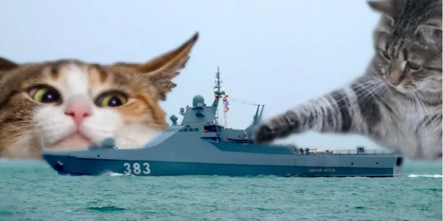

# Морской бой / Battleship



## О проекте
Учебный проект в рамках курса "Технологии и методы программирования". Реализует полноценную игру "Морской бой" с графическим интерфейсом и сетевым мультиплеером (клиент-сервер).

## Команда
* Варламов Егор Михайлович
* Иляков Иван Константинович
* Хайруллин Тахир Зиннурович

## Текущий статус
Сейчас в репозитории подготовлен базовый каркас и echo-сервер:
* `battleship_server` — минимальный TCP echo-сервер
* `battleship_client` — простой клиент для проверки TCP-соединения

## Сборка
Проект использует `CMake` и компилятор `clang++`.

Собрать оба приложения:
```bash
cmake --preset clang-debug
cmake --build --preset build-debug
```

Собрать только клиент:
```bash
cmake --preset clang-client-debug
cmake --build --preset build-client
```

Собрать только сервер:
```bash
cmake --preset clang-server-debug
cmake --build --preset build-server
```

Собрать оба приложения в релизной версии:
```bash
cmake --preset clang-release
cmake --build --preset build-release
```

## Запуск
Запустить сервер:
```bash
./build/{preset}/battleship_server --port 4242
```

Запустить клиент:
```bash
./build/{preset}/battleship_client
```
